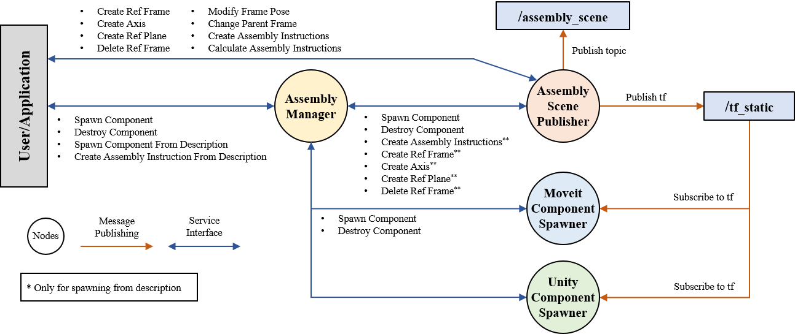

# ROS2 Assembly Manager

## 1. Description
This package provides services to spawn components (parts to be handled or assembled) and to interact with them. It also provides the methodology to calculate the transformation between components based on assembly mates defined in SolidWorks. For a convenient workflow its the easiest to use the SolidWorks exporter (SolidWorks_ASsembly_Instructor (SWASI) repository) that is able to extract the assembly information from CAD as a json, which can be used as input to the assembly manager. The package has been specifically designed to be used for micro-assembly processes as the assembly transformation is calculated based on tf_frames from ROS2. It also uses the “planning_scene_interface” from Moveit2 to visualize components in Rviz2 and to account for collision detection. For more details see sec 2.

## 2. Concept of the ROS Assembly Manager
In an assembly process, the assembly part's (also referred to as components/objects) geometry and position within the assembly machine are crucial information. To be able to assemble goods in a digital simulation of a micro-assembly machine, this package provides an interface to handle components and assemblies within ROS2. 

For more information on how an component is defined in this context see “4. Messages”. Besides geometry and pose of components, precision assembly processes generally rely on several teach points at which different tasks are performed. These teach points can be related to poses of metrology systems, assembly chucks or to specific assembly components (objects). To account for these teach points in ROS2 this package allows to create so called “reference frames” (ref_frames), which simply represent a transformation from a given parent frame to the reference_frame.  

When launched multiple nodes start that interact with each other via service calls and topic messages. The following figure gives an overview of all the involved nodes and the service interfaces between the users and the nodes themselves. 

* `Assembly Scene Publisher`:
A central node is the ’assembly scene publisher’, which handles and publishes all assembly information to the ROS2 topics space (/assembly_scene). It provides multiple services to create reference frames, axes, reference planes, but also assembly instructions, which are able to calculate the transformation of components to achieve an assembly. Additionally, the node also publishes all the registered reference frames and object transformations on the ’tf static’ (tf2) topic from were the information is accessible by the other involved nodes.

* `Assembly Manager`:
Objective of the ’assembly manager’ node is to ensure consistency over the registered components within the different nodes and to react to failed service calls. It serves as interface for spawning and destroying components, as this services have to be forwarted to the other involved nodes. It also provides a service with which a full assembly scene, which might consist of multiple components as well as their reference frames, axes planes and constraints, can be initiated in a single call. This is the intended way of using this package.

* `moveit component spawner`: This node serves as the interface to the planning_scene_interface, with which objects can be spawned in the planning_scene and thus be visulized in Rviz2. The objects are then also considered for collision detection. This node subscribes to the “tf_static” topic and thus updates objects pose information automatically, when a change in the object_publisher occurs. Spawning or destroying objects is called from the object_spawner_manger and is only initiated if spawning and destroying an object in the object_publisher is successful. 

* `unity component spawner`: The unity component spawner node is not part of this package. It interacts with the assembly manager in the same way as the moveit component spawner. You can implement a custom interface to your own robot simulation by interconnecting it in the same way as the moveit component spawner does.




## 3. Installation & Launch
To be able to execute the ros assembly manager, make sure you have the following packages/libaries installed.

* Python - scipy
* Python - sympy
* Python - pip install vtk PyQt6
* apt install ros-humble-moveit
* To-Do: Add other necessary libaries

The installation via rosdep has not been tested but desired in for the future.

To launch the ros assembly manager use the following launch command.
```
ros2 launch assembly_manager assembly_manager.launch.py
```

To-Do: launch argument for sim_time (true or false)
To-Do: Make topics name for 'tf_static' and for '/planning_scene' node parameters, so that they are configurable in the launch file.

## 4. Messages
Messages and Services are sourced from the assembly_manager_interfaces package.
```
Object 
```
(this might be renamed to 'Component' in the future to adhere to the naming convention)

The Object Message message describes an component.

* `obj_name`: Name of the object. This is a unique name.
* `parent_frame`: Name of the parent frame that the object is connected to.
* `obj_pose` (Pose): Pose of the object in reference to the parent frame.
* `cad_data` (str): Geometry information of the object (Path of the STL-file; currently only .STL supported). The geometry is spawned at the given pose. Make sure your CAD-data is exported with respect to the correct spawning pose.
* `ref_frames` (list[RefFrame]): List of all the ref_frames associated with the component.
* `ref_axis` (list[Axis]): List of all the axis associated with the component.
* `ref_planes` (list[Plane]): List of all the planes associated with the component.

```
RefFrame
```
The RefFrameMsg message describes an reference frame.
* `frame_name` (str): Name of the ref_frame. This is a unique name.
* `parent_frame`(str): Name of the parent frame that the ref_frame is connected to (can be any frame on tf topic)
* `pose` (Pose): Pose of the ref_frame in reference to the parent frame

```
RefAxis
```
The RefAxis message describes a reference axis. A ref. axis is defined by two frames. 
* `axis_name` (str): Name of the reference axis.
* `point_names` (str[2]): Names of the points defining the axis. Can be any tf_frames, which have the same parent frame.

```
RefPlane
```
The RefPlaneMsg message describes a reference plane. A refplane is either defined by three point names or by one axis name and one point name.
* `ref_plane_name` (str): Name of the reference plane.
* `point_names` (str[3]): Names of the points defining the plane. Can be any tf_frames, which have the same parent frame.
* `axis_names` (str[1]): Name of the axis normal to the plane.
* `ideal_norm_vector` (geometry_msgs/Vector3): Ideal normalized vector representing the orientation of the plane (derived from CAD).

```
ConstraintPlanes
```
The ConstraintPlanesMsg message describes a pair of constraint planes.
* `plane_name_component_1` (str): Name of the first plane component.
* `plane_name_component_2` (str): Name of the second plane component.
* `plane_offset` (float32): Offset distance between the two planes.
* `inv_normal_vector` (bool): Indicates whether the normal vectors of the planes are inverted.

```
AssemblyInstruction
```
The AssemblyInstructionMsg message describes an assembly instruction. Make sure that for the ConstraintPlane messages the order of the planes is consistent. For usage you would give three planes associated with component one, and three planes associated with component two.
* `id` (str): Identifier for the assembly instruction.
* `component_1_is_moving_part` (bool): Indicates if component 1 is the moving part. If true, component 2 is static.
* `plane_match_1` (ConstraintPlanes): Constraint message 1 for the instruction.
* `plane_match_2` (ConstraintPlanes): Constraint message 2 for the instruction.
* `plane_match_3` (ConstraintPlanes): Constraint message 3 for the instruction.


## 5. Services
Messages and Services are sourced from the spawn_object_interfaces package.
Most services are self-explanatory and take one of the above described messages as input.

The ros assembly manager offers the following services:
```
SpawnObject
```
(This service might be renamed to 'SpawnComponent' to adhere to the naming conventions.)
Call this service to spawn an component.
* `obj_name` (str): Name of the object to spawn. This should be a unique name (unique to the assembly scene and to the tf frames)!
* `parent_frame` (str): Name of the parent frame, the object should be connected to and spawned at
* `translation` (Vector3): Rel. translation at which the object should be spawned with respect to the parent_frame
* `rotation` (Quaternion): Rel. orientation at which the object should be spawned with respect to the parent_frame
* `cad_data` (str): Path to the stl-file of the object
------------------------
* `success` (bool): Returns true if spawning was successful

```
DestroyObject
```
(This service might be renamed to 'DestroyComponent' to adhere to the naming conventions.)
Call this to destroy an component. Calling this will also destroy all feature (frames, axis, planes) that are connected to the component.
* `obj_name` (str): Name of the object to destroy
------------------------
* `success` (bool): Returns true if destroying was successful

```
ChangeParentFrame
```
Call this to change the parent_frame of an components. This call can be only used for components and not for ref_frames. Use case is gripping of a component. 
* `obj_name`: Name of the object
* `parent_frame`: New parent_frame
------------------------
* `success` (bool): Returns true if successful
```
CreateAssemblyInstructions
```
The CreateAssemblyInstructions service is used to create assembly instructions.

* `assembly_instruction` (AssemblyInstruction): Assembly instruction message,
---
* `success` (bool): Success indicator
* `instruction_id` (bool): ID of the created instruction as specified in the assembly_instruction
* `message` (string): Additional information or error message
```
CalculateAssemblyInstructions
```
This service recalculated the assembly instruction specified by the given id
* `instruction_id` (string): Assembly instruction to be recalculated. It must already exist
---
* `success` (bool): Success indicator
* `assembly_transform` (geometry_msgs/Pose): Relative transformation between two components, that specifies how the two components have to be assembled.

```
ModifyPose
```
This service can be called to modify a the pose of an component or a ref_frame.
To-Do: This service has not been tested properly. Please report bugs.
* `frame_name`: Component or ref_frame name
* `rel_pose`: Relative pose to modify the current pose of the component/ref_frame. Translations will be added on current pose; rotations will be applied to current pose.
------------------------
* `success` (bool): Returns true if successful
```
GetScene
```
Call this service to get a full overview of the current assembly scene describte by the registered components and assembly instructions. 
* None
------------------------
* `scene` (ObjectScene): Object Scene message with contains al the registered object messages and assembly instructions.
* `success` (bool): Success indicator
```
SpawnComponentFromDescription
```
Call this service with the filepath to a json as input to spawn a component. The json for a component can be created using our SolidWorks exporter (SWASI). 
* `file_path` (string): Path to the json file describing the component.
* `component_name_override` (string): Overwrite for the component name with which it will be registered in the assembly scene. If left empthy, the name will be derived from the json (in this case you cannot spawn another as this would cause a naming conflict).
------------------------
* `success` (bool): Success indicator
```
SpawnAssemblyInstructionFromDescription
```
Call this service with the filepath to a json as input to spawn a assembly instruction. The json for the assembly can be created using our SolidWorks exporter (SWASI). 
* `file_path` (string): Path to the json file describing the assembly.
* `spawn_components` (bool): If set to true, the service will also spawn the components to the scene.
------------------------
* `success` (bool): Success indicator
* `instruction_id` (bool): ID of the created instruction

## 6. Intendet Usage
This package is intendent to be used in conjunction with the SWASI solidworks exporter, which outputs json files for each assembly and component in an active file. For this to work, the assembies have to be mated together by specific rules. More details on this can be found in the SWASI repository. The workflow for using this package would be:
1. Prepare and export the assembly or the component from SolidWorks.
2. At this point there are two options:
    1. Option a:  Call the service 'SpawnComponentFromDescription' to spawn the exported component to the scene.
    2. Option b: Call the service 'SpawnAssemblyDescription' to spawn the assembly description as well as all involved components to the scene.
3. Measure the reference frames of the components to correct its pose in the scene
4. Recalculate the assembly description 'CalculateAssemblyInstructions' to update the assembly transformation of the involved assembly components.
5. Align the 'assembly' frame (moving frame) to the 'target' frame (static). Both frames are available on the tf_static topic an are created when calculating the assembly description. When alligned the desired assembly transformation between the components is achieved.

## 7.To-Dos
1. Extend and check functionality of the ModifyPose srv.
2. Allow for topic namespacing by making node parameters.